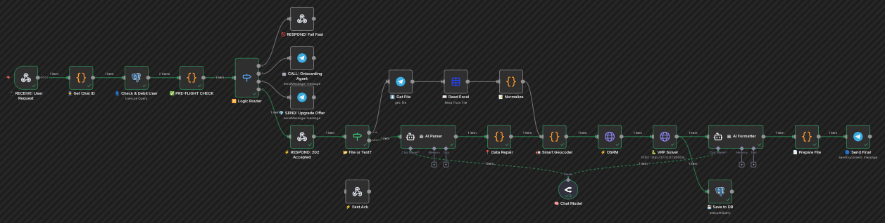

# 🌏 SEA Logistics AI Dispatcher

> **Autonomous Route Optimization System powered by n8n, DeepSeek AI & OSRM.**
> *Optimized for high-density Asian cities (Jakarta, Ho Chi Minh, Bangkok).*

## 🚀 Project Overview

This project is a production-ready **n8n workflow** designed to automate the entire logistics dispatching process for SMEs in Southeast Asia.

It solves a critical problem in the region: **Unstructured Addresses**.
Unlike Western addresses, SEA addresses are often descriptive (e.g., *"Blue store next to the market"*). This system uses LLMs (Large Language Models) to parse these addresses and optimize delivery routes in real-time.

---

## 💡 Key Features

### 1. 🧠 AI Address Parsing (DeepSeek / LangChain)
- Extracts structured data (Street, City, Vehicle count) from unstructured text input (WhatsApp/Telegram).
- Detects language automatically (Bahasa Indonesia / English / Vietnamese).
- **Benefit:** Eliminates manual data entry errors.

### 2. 📍 Hybrid Geocoding Strategy
- Uses a **Local Nominatim Server (Docker)** for speed and privacy.
- Fallback to Public OSM API for obscure locations.
- **Benefit:** High reliability even with poor connectivity.

### 3. 🚚 VRP Solver (Vehicle Routing Problem)
- Calculates the most efficient path for multiple vehicles (Trucks/Motorbikes).
- Constraints handling: Capacity, Time windows, Depot location.
- **Benefit:** Reduces fuel consumption by ~15-20%.

### 4. 🔒 100% Self-Hosted & Private
- No data is sent to Google Maps or US-based SaaS.
- Full Data Sovereignty suitable for Industrial & Financial clients.

---

## 🛠 Tech Stack

*   **Orchestration:** [n8n](https://n8n.io/) (Workflow Automation)
*   **Database:** PostgreSQL (User credits & KPIs)
*   **AI Model:** DeepSeek-V3 via OpenRouter (or Local LLM)
*   **Routing Engine:** OSRM (Open Source Routing Machine)
*   **Interface:** Telegram Bot API

---

## 📊 How it Works (The Flow)

1.  **Input:** User sends a raw list of deliveries via Telegram.
2.  **Process:**
    *   `AI Parser` cleans the text.
    *   `Smart Geocoder` converts text to GPS coordinates.
    *   `VRP Solver` computes the mathematical optimal route.
3.  **Output:** Driver receives a structured manifest with **Waze/Google Maps Deep Links** sorted by efficiency.

---

## 👨‍💻 About the Author

**Abdel YOUSFI**
*AI Automation Consultant & Workflow Architect based in SEA.*

I help Industrial and Logistics companies automate complex processes using Self-Hosted AI Agents.

*   **Expertise:** n8n, Python, Docker, Industrial AI.
*   **Contact:** https://www.linkedin.com/in/abdel-yousfi/
